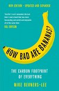

# The Climate and Environment Reading List

A list of popular science books I found most useful when researching climate change and other environmental issues.

## Contents
  * [Action Plans](#action-plans)
  * [Agriculture](#agriculture)
  * [Air Pollution](#air-pollution)
  * [Biodiversity](#biodiversity)
  * [Carbon Footprint](#carbon-footprint)
  * [Economics and Finance](#economics-and-finance)
  * [History of Climate Change](#history-of-climate-change)
  * [Natural Resources](#natural-resources)
  * [Nuclear Disasters](#nuclear-disasters)

## Action Plans

| Title, author, publisher | Paperback cover |
| ------------------------ | --------------- |
| [_How to Avoid a Climate Disaster: The Solutions We Have and the Breakthroughs We Need_. Bill Gates. Penguin Books, 2022.](https://uk.bookshop.org/p/books/how-to-avoid-a-climate-disaster-the-solutions-we-have-and-the-breakthroughs-we-need-bill-gates/1305189?ean=9780141993010) |  |
| [_Speed & Scale: A Global Action Plan for Solving Our Climate Crisis Now_. John Doerr. Penguin Books, 2021.](https://uk.bookshop.org/p/books/speed-scale-a-global-action-plan-for-solving-our-climate-crisis-now-john-doerr/6161168?ean=9780241537770) |  |

## Agriculture

| Title, author, publisher | Paperback cover |
| ------------------------ | --------------- |
| [_Regenesis: Feeding the World Without Devouring the Planet_. George Monbiot. Penguin Books, 2023.](https://uk.bookshop.org/p/books/regenesis-feeding-the-world-without-devouring-the-planet-george-monbiot/7271836?ean=9780141992990) |  |

## Air Pollution

| Title, author, publisher | Paperback cover |
| ------------------------ | --------------- |
| [_Choked: The Age of Air Pollution and the Fight for a Cleaner Future_. Beth Gardiner. Granta Books, 2020.](https://uk.bookshop.org/p/books/choked-the-age-of-air-pollution-and-the-fight-for-a-cleaner-future-beth-gardiner/586237?ean=9781846276477) |  |
| [_Clearing the Air: The Beginning and the End of Air Pollution_. Tim Smedley. Bloomsbury Publishing, 2020.](https://uk.bookshop.org/p/books/clearing-the-air-shortlisted-for-the-royal-society-science-book-prize-tim-smedley/1246586?ean=9781472953339) |  |

## Biodiversity

| Title, author, publisher | Paperback cover |
| ------------------------ | --------------- |
| [_Rewilding the Sea: How to Save Our Oceans_. Charles Clover. Ebury Publishing, 2023.](https://uk.bookshop.org/p/books/rewilding-the-sea-how-to-save-our-oceans-charles-clover/7296732?ean=9781529144055) |  |

## Carbon Footprint

| Title, author, publisher | Paperback cover |
| ------------------------ | --------------- |
| [_How Bad Are Bananas?: The carbon footprint of everything_. Mike Berners-Lee. Profile Books, 2020.](https://uk.bookshop.org/p/books/how-bad-are-bananas-the-carbon-footprint-of-everything-mike-berners-lee/1283577?ean=9781788163811) |  |
| [_The Carbon Almanac_. Multiple Authors. Penguin Books, 2022.](https://uk.bookshop.org/p/books/the-carbon-almanac-the-carbon-almanac-network/6906068?ean=9780241594827) |  |

## Economics and Finance

| Title, author, publisher | Paperback cover |
| ------------------------ | --------------- |
| [_The Value of a Whale: On the Illusions of Green Capitalism_. Adrienne Buller. Manchester University Press, 2022.](https://uk.bookshop.org/p/books/the-value-of-a-whale-on-the-illusions-of-green-capitalism-adrienne-buller/6240211?ean=9781526162632) |  |

## History of Climate Change

| Title, author, publisher | Paperback cover |
| ------------------------ | --------------- |
| [_Fire & Flood: A People's History of Climate Change, from 1979 to the Present_. Eugene Linden. Penguin Books, 2023.](https://uk.bookshop.org/p/books/fire-and-flood-a-people-s-history-of-climate-change-from-1979-to-the-present-eugene-linden/6342380?ean=9780141999968) |  |
| [_Losing Earth: The Decade We Could Have Stopped Climate Change_. Nathaniel Rich. Pan Macmillan, 2020.](https://uk.bookshop.org/p/books/losing-earth-the-decade-we-could-have-stopped-climate-change-nathaniel-rich/236464?ean=9781529015843) |  |

## Natural Resources

| Title, author, publisher | Paperback cover |
| ------------------------ | --------------- |
| [_Volt Rush: The Winners and Losers in the Race to Go Green_. Henry Sanderson. Oneworld Publications, 2020.](https://uk.bookshop.org/p/books/volt-rush-the-winners-and-losers-in-the-race-to-go-green-henry-sanderson/7024599?ean=9780861546190) |  |

## Nuclear Disasters

| Title, author, publisher | Paperback cover |
| ------------------------ | --------------- |
| [_Manual for Survival: A Chernobyl Guide to the Future_. Kate Brown. Penguin Books, 2020.](https://uk.bookshop.org/p/books/manual-for-survival-a-chernobyl-guide-to-the-future-kate-brown/1004360?ean=9780141988542) |  |
